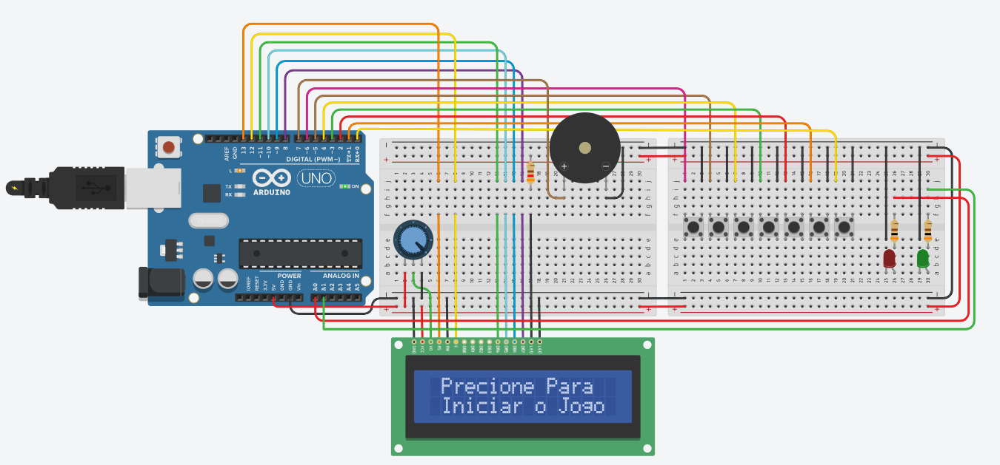
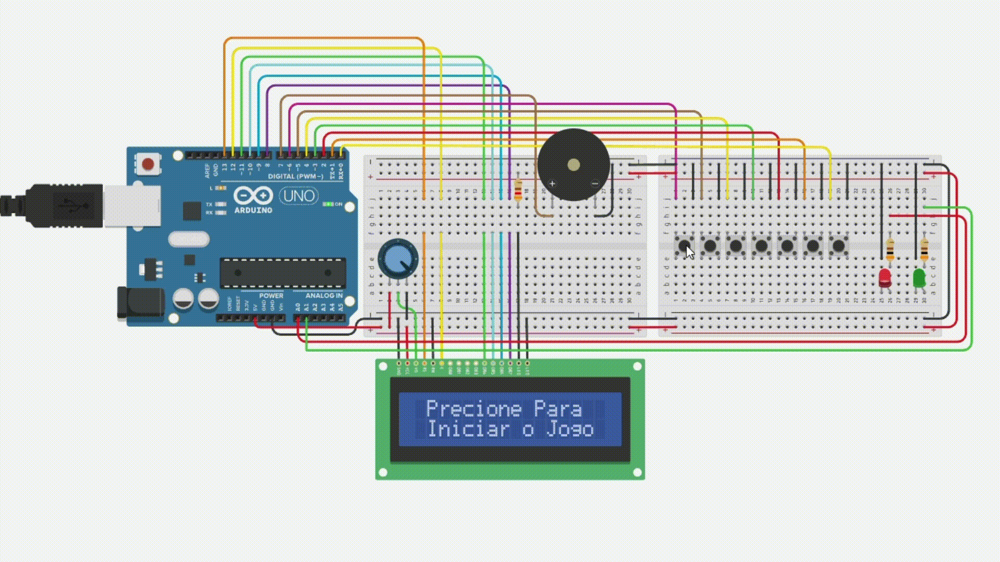
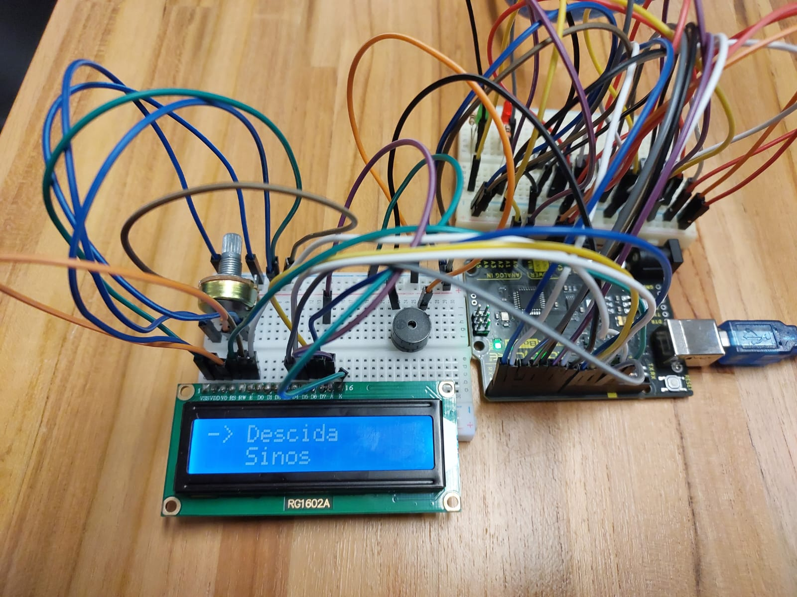
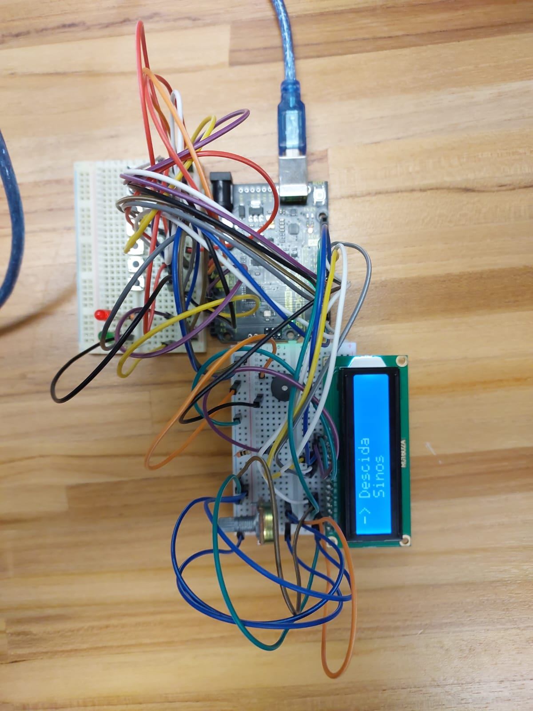

# 🎵 Tone-Memorize

Este projeto visa desenvolver um jogo da memória musical utilizando Arduino, onde o jogador deve repetir corretamente sequências de notas musicais tocadas por um buzzer. O jogo busca testar a memória auditiva e a atenção do usuário, com aumento progressivo de dificuldade conforme o jogador acerta as sequências. O objetivo principal é aplicar conceitos de eletrônica e programação embarcada para criar uma experiência interativa e educativa.

## 🧩 Materiais Utilizados

- 1 Arduino UNO
- 7 botões (push-buttons)
- 2 LEDs (verde e vermelho)
- 1 Buzzer
- 1 Display LCD 16x2
- 3 Resistores de 300Ω
- 1 Potenciômetro
- Protoboard e jumpers

## ➕ Descrição do projeto

O projeto foi desenvolvido utilizando a IDE do Arduino e o site www.tinkercad.com para montagem inicial e testes de código. A estrutura do código foi pensada para organizar o jogo em fases, com níveis de dificuldade crescentes. O LCD exibe mensagens de orientação, o buzzer toca as notas, e os botões servem como interface de entrada para o jogador repetir a sequência, onde cada botão corresponde a uma nota musical (de C4 a B4)

Link do projeto montado no Tinkercad: [Projeto](https://www.tinkercad.com/things/5CilTY47dbB-tone-memorize?sharecode=XQmuy8N7jzKC_uKfOMpLOEqgihYmb-7ALsyg3sjoZX4)

## 📁 Organização do Código

O código do projeto foi organizado da seguinte maneira:

- `Musica`: struct que define o nome, notas e durações.
- `musicas[]`: array com as 5 músicas disponíveis.
- `setup()`: configura os pinos e exibe a tela inicial.
- `loop()`: gerencia o início do jogo.
- `iniciarMusica()`: executa o ciclo do jogo por níveis.
- `tocarMusica()`: toca uma sequência de notas.
- `getSequenciaBt()`: coleta a entrada do jogador.
- `compararArrays()`: verifica se o jogador acertou.
- `menu()`: exibe o menu de músicas.
- `mscAcerto()`, `mscGanho()`, `mscGameOver()`: músicas de evento.

## 🛠️ Definição dos pinos

| Componente     | Pino Arduino |
|----------------|--------------|
| Botão 1        | 6            |
| Botão 2        | 5            |
| Botão 3        | 4            |
| Botão 4        | 3            |
| Botão 5        | 2            |
| Botão 6        | 1            |
| Botão 7        | 0            |
| Buzzer         | 7            |
| LCD RS         | 8            |
| LCD Enable     | 9            |
| LCD D4         | 10           |
| LCD D5         | 11           |
| LCD D6         | 12           |
| LCD D7         | 13           |
| LED Vermelho   | 14 (A0)      |
| LED Verde      | 15 (A1)      |

## 🎼 Músicas Disponíveis
O jogo possui 5 músicas pré-definidas com diferentes padrões de notas, todas elas podendo ser selecionadas durante a execução. Cada música tem um nome e uma sequência de notas e durações.

- Trilha Alegre – alterna entre notas agudas e graves.
- Subida – escala musical ascendente.
- Descida – escala descendente.
- Sinos – padrões suaves e melódicos.
- Eco – repetições de notas com ritmo variado.

## 🚀 Fluxo do Jogo:

- O jogador deve pressionar o primeiro botão para iniciar e entrar no menu de seleção de música.
- Utilizando os botões 1 (Subir o menu), 2 (Descer o menu) e 7 (Selecionar), o jogador define qual música gostaria de tentar.
- É tocada a sequência de notas dos botões para memorização.
- A música selecionada é tocada inicialmente com apenas 2 notas.
- O jogador deve repetir a sequência correta nos botões.
- Se acertar, avança para o próximo nível, onde é adicionada mais 2 notas a cada nível. Se errar, perde uma vida.
- O jogo termina com vitória (ao completar todos os níveis com um total de 8 notas) ou derrota (ao perder todas as vidas).

## 💻 Imagens do projeto

## 💡 Considerações finais do projeto

O desenvolvimento do jogo da memória musical proporcionou uma rica oportunidade de aplicar conhecimentos de eletrônica, lógica de programação e criatividade. O projeto não só cumpriu seu objetivo de criar um jogo interativo e educativo, mas também evidenciou a capacidade do Arduino em controlar múltiplos dispositivos de forma coordenada. A experiência foi enriquecedora, principalmente pela combinação de estímulos visuais (LEDs e LCD) e auditivos (buzzer), o que tornou o jogo envolvente e desafiador. Além disso, a modularidade do código e do hardware permite futuras expansões, como a adição de mais músicas, modos de jogo ou até comunicação com aplicativos externos.

Durante o desenvolvimento do projeto, algumas dificuldades técnicas e lógicas foram enfrentadas:
Limitações de pinos do Arduino: Com muitos botões, LEDs, LCD e o buzzer conectados, houve um planejamento cuidadoso da pinagem, além da necessidade de reutilizar pinos com lógica compartilhada e considerar expansores como shift registers em versões futuras.
Gerenciamento da lógica de fases: A estruturação do código para lidar com diferentes níveis, verificações de acertos e vidas restantes exigiu planejamento para manter o código legível e funcional.
Limite de memória do Arduino: Com múltiplas músicas, LCD e lógica de jogo, a memória do Arduino foi levada ao limite, exigindo otimização.
